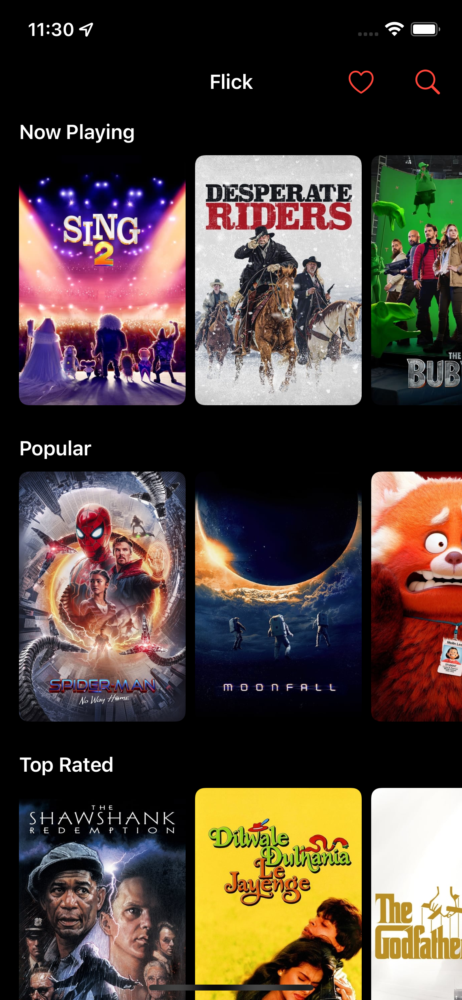
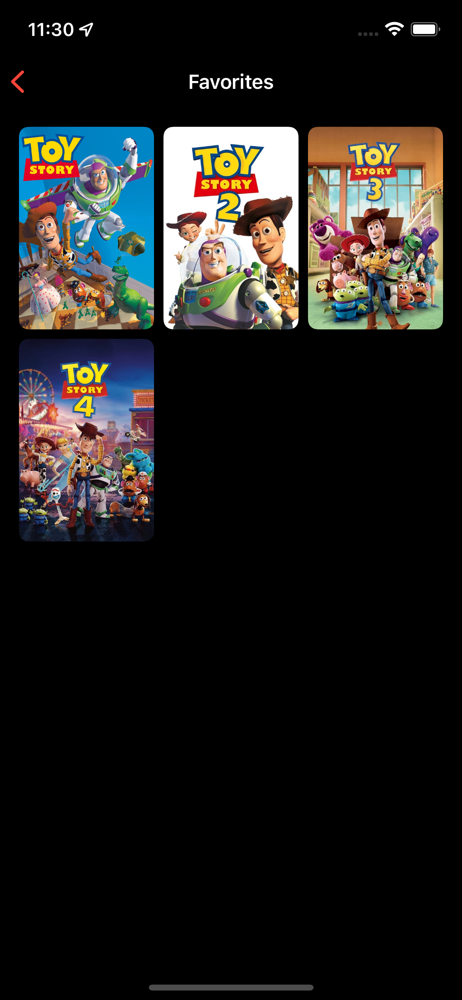
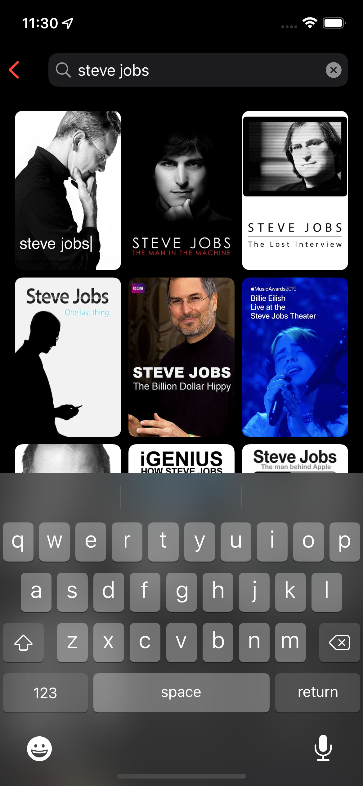
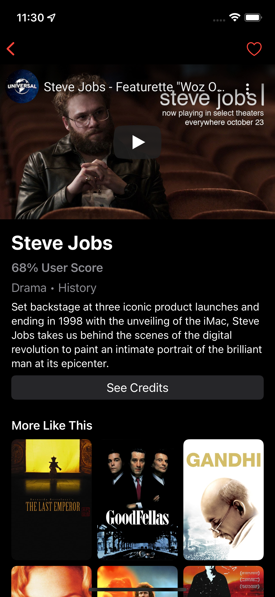
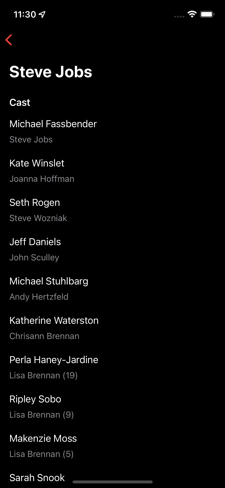

# Flick

**Flick** is an iOS application that uses **The Movie Database API**.

- MVVM
- Swift
- UIKit
- Combine
- Realm
- Modern Collection View
- Modern Cell Configuration
- Modern Swift Concurrency
- XCTest

## Screenshots

|  |  |  |
|--|--|--| 
|  |  |
